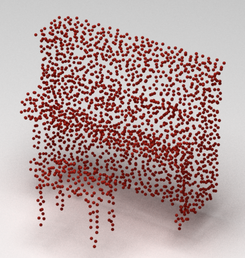
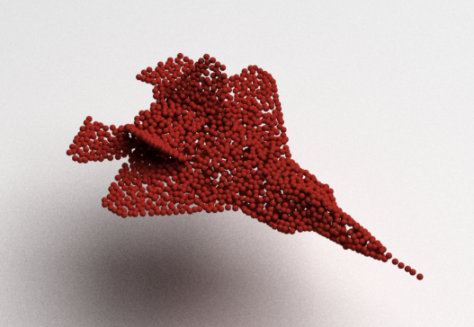

# Nopain
**NoPain: No-box Point Cloud Attack via Optimal Transport Singular Boundary**


## Introduction
This repository offers a No-box Point Cloud Attack, capable of efficiently generating transferable adversarial samples without requiring iterative updates or guidance from surrogate classifiers.

Adversarial attacks exploit the vulnerability of deep models against adversarial samples. Existing point cloud attackers are tailored to specific models, iteratively optimizing perturbations based on gradients in either a white-box or black-box setting. Despite their promising attack performance, they often struggle to produce transferable adversarial samples due to overfitting the specific parameters of surrogate models. To overcome this issue, we shift our focus to the data distribution itself and introduce a novel approach named NoPain, which employs optimal transport (OT) to identify the inherent singular boundaries of the data manifold for cross-network point cloud attacks. Specifically, we first calculate the OT mapping from noise to the target feature space, then identify singular boundaries by locating non-differentiable positions. Finally, we sample along singular boundaries to generate adversarial point clouds. Once the singular boundaries are determined, NoPain can efficiently produce adversarial samples without the need of iterative updates or guidance from the surrogate classifiers. Extensive experiments demonstrate that the proposed end-to-end method outperforms baseline approaches in terms of both transferability and efficiency, while also maintaining notable advantages even against defense strategies.

## Results




## Usage

### Setup Environment


1. **Clone the repository and navigate to the project directory:**

   ```bash
   git clone https://github.com/cognaclee/nopain
   cd nopain
   ```
2. **Create and activate the environment using the provided YAML file:**
	```
	# Create the environment based on nopain.yaml
	conda env create --file nopain.yaml --name nopain
	# Activate the environment
	conda activate nopain

	# Setup the environment for the Pointmamba classifier
	conda env create --file nopain_pointmamba.yaml --name nopain_pointmamba
	conda activate nopain_pointmamba
	```

### Prepare Data and Models

1. **Download the datasets and place them in the `data/` directory:**

	```
	data/
	├── shapenetcore_partanno_segmentation_benchmark/
	├── ScanObjectNN/
	└── modelnet40_normal_resampled/
	```
2. **Download the [pretrained models](https://drive.google.com/drive/folders/1K0i1Q-77maDBT03fSGRQzHXA1bvgNSD5?usp=drive_link) and place them in the `pretrained/` directory:**
	```
	# Create the pretrained directory if it doesn't exist
	mkdir -p pretrained
	```

### Run Nopain
This example demonstrates an attack on the ModelNet40 dataset using a point diffusion-based autoencoder. If your target is a different dataset or architecture, please use the corresponding scripts provided in this project.
1. **Extract Features and Run Test Script:**
	```bash
	# The first time you run Nopain, use the following command to extract features
	python test_ae_mn40_cd.py --extract_feature
	```
2. **Use Pretrained OT:**
	```bash
	# If you want to use a pretrained OT, run the following command
	# Replace `<your directory>` and `<your_ot.pt>` with your specific paths
	python "./test_ae_mn40_cd.py" --source_dir results/<your directory>/ --h_name results/<yourdirectory>/ot/<your_ot.pt>
	```
3. **Results:**
The results from Nopain will be saved in the `results/` directory.
## Acknowledgments
```
* https://github.com/cuge1995/SS-attack
* https://github.com/luost26/diffusion-point-cloud
* https://github.com/stevenygd/PointFlow
```


## Citation

```

```
